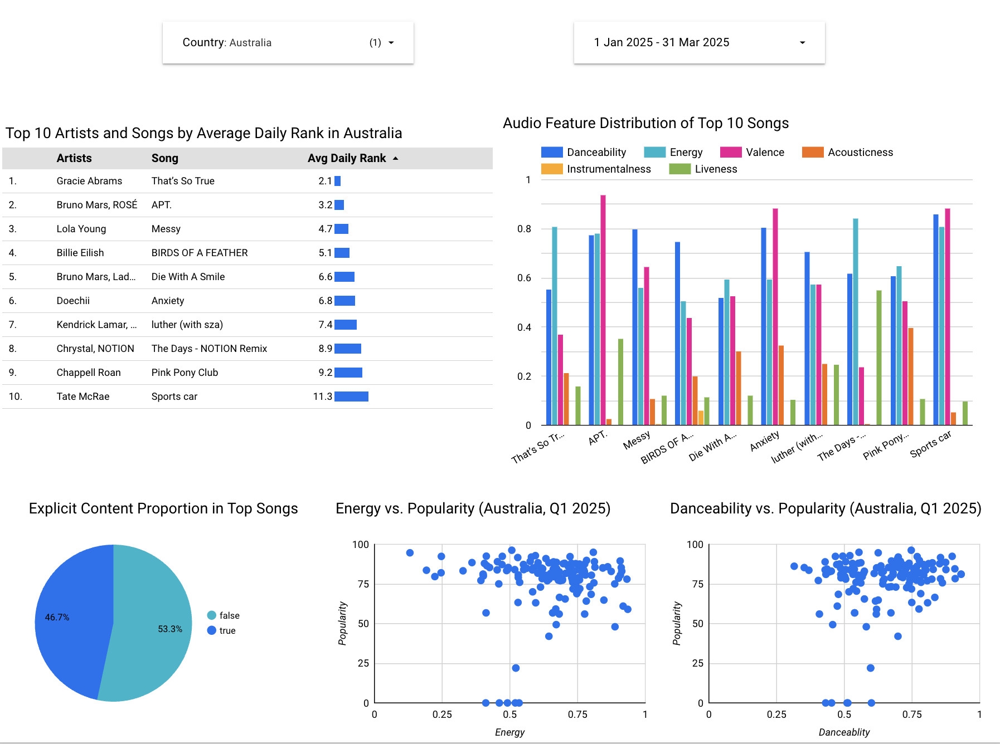

# Spotify Analytics

The goal of this project is to analyze the characteristics and trends of popular Spotify songs in the Australian market within the first quarter of 2025 (January 1 to March 31).

## Dataset Overview
This project uses a dataset sourced from Kaggle:  
**[Top Spotify Songs in 73 Countries (Daily Updated)](https://www.kaggle.com/datasets/asaniczka/top-spotify-songs-in-73-countries-daily-updated)**

The dataset contains **daily snapshots of the Top 50 Spotify songs** across 73 countries, including global charts, from which we extracted records specific to **Australia** for the date range **January 1 to March 31, 2025**.

Each record in the dataset represents a song's daily performance in a specific country and includes both **ranking metrics** and **audio characteristics**.

## Problem description

This analysis focuses on answering the following questions:
- Which artists and songs consistently achieved top rankings in Australia during this period? → Presented via a table showcasing the top 10 artists and their songs by average daily rank.

- What are the most common audio characteristics among the highest-ranked songs? → Visualized using bar charts of average values across six audio features for the top 10 ranked songs.

- How does danceability influence popularity in the Australian market? → Investigated through a scatter plot of danceability vs. popularity.

- How does energy level relate to popularity? → Explored using a scatter plot of energy vs. popularity.

- What proportion of top songs in Australia are marked as explicit content? → Visualized using a pie chart breakdown of explicit vs. non-explicit tracks.

Through these visualizations, this project reveals insights into how audio features and content type may impact song performance in Spotify’s Australian Top 50 charts.

## Technology Ueed
- Containerization (Docker)
- Cloud Platform: Google Cloud Platform (GCP)
- Infrastructure as Code: Terraform
- Workflow Orchestration: Kestra
- Data Lake: Google Cloud Storage (GCS)
- Data Warehouse: BigQuery
- Data Transformation: dbt
- Data Visualization: Looker Studio

## Data Visualization

[See Dashboad](https://lookerstudio.google.com/reporting/4b1b020d-c5f7-4ab3-9a1c-bde2f23df666)

## Reproduce the Project

Here is the reproduce [instruction](https://github.com/zx-99/data-engineering-zoomcamp2025-project/tree/main/guide/reproduce.md).