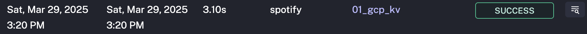
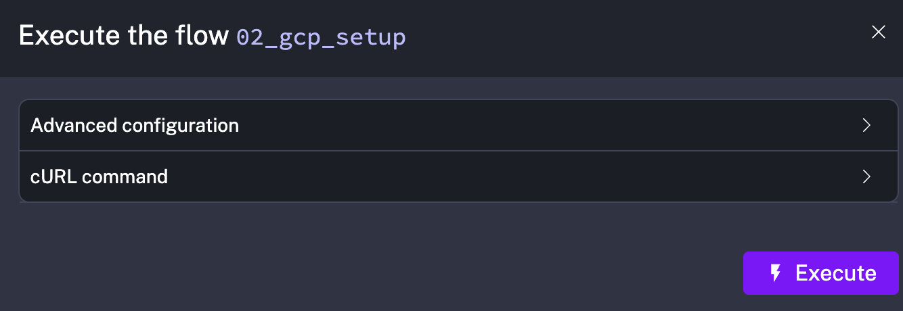
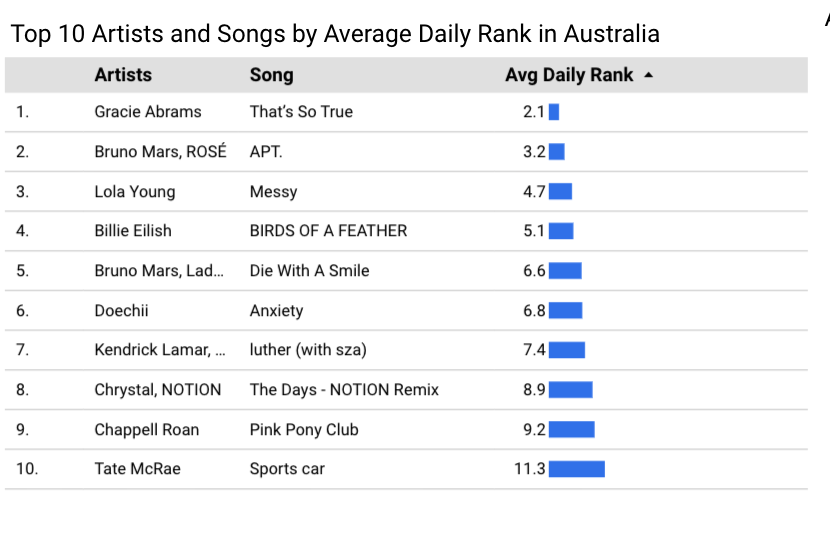
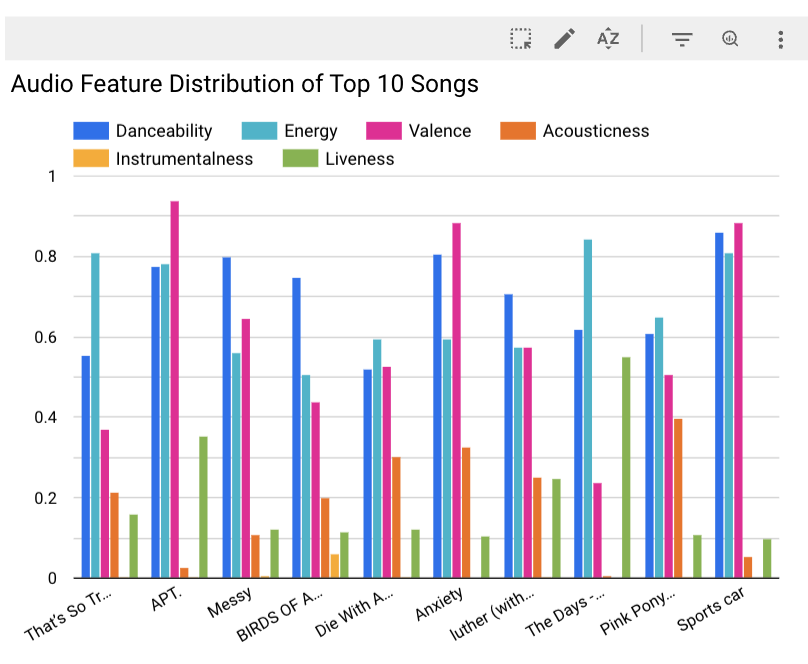

# 🛠 Reproduce Guide

## ✅ Create a New GCP Project

Navigate to [Google Cloud Platform](https://console.cloud.google.com/) and create a new project by clicking the dropdown next to the current project name, then click **NEW PROJECT**.

## ✅ Create a Service Account

1. Go to **IAM & Admin > Service Accounts** via the navigation menu.
2. Click **CREATE SERVICE ACCOUNT**, name it `project-demo`, and assign the following roles:
   - BigQuery Admin
   - Storage Admin
   - Compute Admin
3. After creation, click the ellipsis next to the account and choose **Manage keys**.
4. Click **ADD KEY** > **Create new key** > Choose **JSON** > **CREATE**.
   - This downloads your credentials file (save it securely).

## ✅ Setup Infrastructure with Terraform

1. Navigate to the terraform directory:

```bash
cd terraform
```

2. Install Terraform (if not installed):

```bash
brew install hashicorp/tap/terraform
```

3. Edit the `variables.tfvars` file:
   - Set up your serive accout JSON file path in ```credentials```
   - Set your GCP project ID
   - Leave others as **default**
4. Initialize Terraform:

```bash
terraform init
```

5. Preview the Terraform plan:

```bash
terraform plan
```

6. Apply the configuration to create resources:

```bash
terraform apply
```

- When prompted, type `yes` to confirm.

## ✅ Setup Pipelines in Kestra

1. Navigate to the Kestra directory:

```bash
cd workflow_orchestration
```

2. Launch Kestra with Docker Compose:

```bash
docker-compose up -d
```

- Access Kestra UI at: [http://localhost:8080](http://localhost:8080)

3. Run the following commands to add flows programmatically using Kestra's API:

```bash
curl -X POST http://localhost:8080/api/v1/flows/import -F fileUpload=@flows/01_gcp_kv.yaml
curl -X POST http://localhost:8080/api/v1/flows/import -F fileUpload=@flows/02_gcp_setup.yaml
curl -X POST http://localhost:8080/api/v1/flows/import -F fileUpload=@flows/03_gcp_spotify_pipeline.yaml
```

4. In the UI:

   - Go to Namespace > `spotify`
   - Open **KV Store** and create `GCP_CREDS`
   - Paste JSON from your service account


5. Execute Flows:


   - Run `gcp_kv` → input your Project ID and leave others as default → execute




   - Run `gcp_setup`





   - Run `gcp_spotify_pipeline`


7. Confirm data has been loaded:

   - Check GCS bucket
   - Check BigQuery


To stop Kestra:

```bash
docker compose down
```

## ✅ Transform Data with dbt (dbt Cloud)
Create a dbt user account by going to [dbt homepage](https://www.getdbt.com/) and signing up for a free account.

Non-enterprise account can have only one project. Navigate to Account > Projects to delete any old project. Now we can go to the homepage to setup a new project. Please set up the project detail as following.


Add new connection --> Select BigQuery

Click on Upload a Service Account JSON file


Find Optional settings, then set location to **australia-southeast1**, click on Save


Back on your project setup, select BigQuery:


Set values as following, then test the connection and click on save the Development credentials, :


Now its time to setup a repository:


Select git clone and paste the SSH key from your repo:


Click on import --> Click on next

You will get a deploy key
Head to your Github repo and go to the settings tab. You'll find the menu deploy keys. Click on add key and paste the deploy key provided by dbt cloud. Make sure to click on "write access":


Back on dbt cloud, click on next, you should look this:


Also make sure you set **dbt/spotify** as the project subdirectory.

Navigate to **Develop** tab on the top to view the project.

dbt does not allow us to work on the main branch after this, hence we need to create a new branch.

### Build the dbt project
If we click on the Lineage tab in the bottom, we should see this diagram:

To build the project run:
```bash
dbt build
```
dbt docs can be generated on the cloud or locally with ```dbt docs generate```, and can be hosted in dbt Cloud.

Now, if we navigate to BigQuery we will be able to see the tables created by dbt which is **dbt_spotify**.


## ✅ Visualize with Looker Studio

Navigate to Google Looker Studio.

Click on **Create** > **Data source** > **BigQuery** > authorize **BigQuery** > select the Project > Dataset > Table (**fact_spotify**) > **CONNECT**.

Change the default aggregation of categorical fields from **Sum** to **None**. 

Change the following aggregation of fields to AVG. 

Then, click on **CREATE REPORT** > **ADD TO REPORT**.Rename the report as **Spotify 2025 Q1 in AU**

### Country control
1. Add a control of Drop-down list
2. Date range dimension = ```snapshot_date```
3. Control field = ```country```
4. Select ```Australia```

### Date control
1. Add a control of Date range control
2. Select ```1 Jan 2025 - 31 Mar 2025```

### Top 10 Artists and Songs by Average Daily Rank in Australia
1. Create Table with bars
2. Date range dimension = ```snapshot_date```
3. Dimension = ```artists```, ```song_name``` 
4. Metric = AVG ```daily_rank```
5. Number of row= Top 10
6. Sort = AVG ```daily_rank``` ASCENDING
7. Go to **STYLE** -> **Metrics** -> Select **Show number** & **Compact numbers**

### Audio Feature Distribution of Top 10 Songs
1. Create Column Chart
2. Date range dimension = ```snapshot_date```
3. Dimension = ```song_name```
4. Metric = AVG ```danceability```, AVG ```energy```, AVG ```valence```, AVG ```acousticness```, AVG ```instrumentalness```, AVG ```liveness```
5. Sort = AVG ```daily_rank``` ASCENDING 

### Explicit Content Proportion in Top Songs
1. Create Pie chart
2. Date range dimension = ```snapshot_date```
3. Dimension = ```is_explicit```
4. Metric = CTD ```song_name```


### Energy vs. Popularity (Australia, Q1 2025)
1. Create Scatter chart
2. Date range dimension = ```snapshot_date```
3. Dimension = ```song_name```
4. Metric X = AVG ```energy```
5. Metric Y = AVG ```popularity```
6. Sort = AVG ```energy``` DESCENDING


### Danceability vs. Popularity (Australia, Q1 2025)
1. Create Scatter chart
2. Date range dimension = ```snapshot_date```
3. Dimension = ```song_name```
4. Metric X = AVG ```danceability```
5. Metric Y = AVG ```popularity```
6. Sort = AVG ```danceability``` DESCENDING


## 🧹 Destroy Resources

1. Navigate to the terraform directory
```bash
cd terraform/
```
2. Destroy resources created by terraform
```bash
terraform destroy
```
3. Delete GCP project
4. Delete dbt project
5. Delete Looker Studio dashboard
